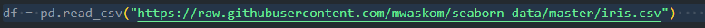
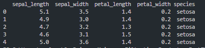

<h1 align="center">Higher Diploma in Science in Computing (Data Analytics)</h1>
<h1 align="center">Programming and Scripting - Iris Exploratory Data Project
</h1>

# Table of Contents
1. Introduction

2. Import Libraries

3. Load Data
    - 3.1 Load the Iris data
    - 3.2 How to run the Python code
    - 3.3 Check the top 5 rows
    - 3.4 Initial inspection of the data

4. Data Exploration
    - 4.1 Check for the DataFrame with pandas .info() method
    - 4.2 Selecting data by row numbers df.iloc() method
    - 4.3 Generate descriptive statistics with pandas .describe () method

5. Cleaning the Dataset
    - 5.1 Identify missing values

6. Data Analysis
    - 6.1 Univariate Analysis
      - 6.1.1 Histogram
        - 6.1.1.1   iris_histogram_petal_length.png
        - 6.1.1.2   iris_histogram_petal_width.png
        - 6.1.1.3   iris_histogram_sepal_length.png
        - 6.1.1.4   iris_histogram_sepal_width.png
      - 6.1.2 Box Plot
        - 6.1.2.1 iris_boxplot.png

    - 6.2 Bivariate Analysis
      - 6.2.1 Correlation Coefficients
        - 6.2.1.1 iris_heatmap.png
      - 6.2.2 Scatter Plots
        - 6.2.2.1 iris_scatterplot.png
            - Petal Width vs Petal Length
            - Sepal Width vs Sepal Length
      - 6.2.3 Kernel Density Estimate (KDE) Plot
        - 6.2.3.1 iris_line_chart_petal_length.png
        - 6.2.3.2 iris_line_chart_petal_width.png
        - 6.2.3.3 iris_line_chart_sepal_length.png
        - 6.2.3.4 iris_line_chart_sepal_width.png

7. Conclusion

8. About Author

9. List of references

# 1. Introduction

This repository contains my submission for the Programming and Scripting Project 2024 class project for the Programming and Scripting Module at ATU Galway as part of the Higher Diploma in Science in Data Analytics.
The goal of this project is to research the Iris data set and write documentation and code in Python to investigate it.

The Iris Dataset is renowned in the field of machine learning and statistics and is used for exploratory data analysis. The data set known as Fisher’s Iris data is a multivariate data set used and made famous by the British statistician and biologist [Ronald Fisher](https://en.wikipedia.org/wiki/Ronald_Fisher) in his 1936 paper "The use of multiple measurements in taxonomic problems as an example of linear discriminant analysis".

The data set consists of 50 samples from each of three species of Iris (*I. Setosa*, *I. Virginica* and *I. Versicolor*). Four features were measured from each sample: the length and the width of the sepals and petals, in centimeters. [[1]](https://en.wikipedia.org/wiki/Iris_flower_data_set)

###### [1] [Iris flower data set](https://en.wikipedia.org/wiki/Iris_flower_data_set)

###### [Picture credit:Pycodemates](https://blogger.googleusercontent.com/img/b/R29vZ2xl/AVvXsEimmGMPw0jM_8xjndEHLKj7Hf5fngvWFOJ6_V4jiFb-U0sCHej3aTu08htye1_BgUBGKfnszHoeI_OLLZVf6NjwaG9oDYyOqkjdjeDajd3zg8VuCLVTzDM8hO2XEnarwQeM-CLvFgAwfNX53GR_HPatNPkUH7-7FAoNgFKjw7ujB9LwW5piE8GIPLjJHw/s722/irir_flowers.png)

# 2. Imports Libraries

I imported the following libraries to analyse the dataset in Visual Studio Code.

- Pandas: Fundamental data analysis and manipulation library built on top of the Python programming language. It offers data structures and operations for manipulating numerical tables and time series. [[2]](https://www.w3schools.com/python/pandas/default.asp)
  
- NumPy: It contains functionality for multidimensional arrays, high-level mathematical functions such as linear algebra operations. [[3]](https://www.w3schools.com/python/numpy/default.asp)
  
- Matplotlib: Essential for creating static, animated, and interactive visualizations in Python. It is closely integrated with NumPy and provides a MATLAB-like interface for creating plots and visualizations. [[4]](https://www.w3schools.com/python/matplotlib_intro.asp)
  
- Seaborn: Seaborn provides a high-level interface for drawing attractive statistical graphics. [[5]](https://seaborn.pydata.org/)
  
- io: The io module  provides classes and functions for working with input and output streams, such as files, strings, and network connections, in a uniform way. [[6]](https://docs.python.org/3/library/io.html)

- warnings: to filter warning messages

###### [2] [Pandas Tutorial w3schools](https://www.w3schools.com/python/pandas/default.asp)

###### [3] [NumPy Tutorial w3schools ](https://www.w3schools.com/python/numpy/default.asp)

###### [4] [Matplotlib Tutorial w3schools](https://www.w3schools.com/python/matplotlib_intro.asp)

###### [5] [seaborn: statistical data visualization](https://seaborn.pydata.org/)

###### [6] [io: Core tools for working with streams](https://docs.python.org/3/library/io.html)

# 3. Load Data

## 3.1 Load the Iris data

### Rationale:
I need to load the data set from a URL. The dataset is available on [GitHub](https://raw.githubusercontent.com/mwaskom/seaborn-data/master/iris.csv)

### Findings:
The data is now loaded, time to check it and explore but first how to run the code. 

## 3.2 How to run the Python code

The following are required
 - Visual Studio Code: download from [here](https://code.visualstudio.com/download)
 - Github must be installed, get it [here](https://github.com/git-guides/install-git)
 - Clone this [repository](https://github.com/SBCURLEY/pands-project/blob/main/analysis.py) from Github by typing the command below: git clone
 - To run the Python script, first navigate to the Pands Folder > pands-project > analysis.py
 - The GitHub link is [here](https://github.com/SBCURLEY/pands-project/blob/main/analysis.py)
 - At the command line enter python the following
 
**$ python analysis.py**
 
The code will do the following:

 - Outputs a summary of each variable to a single text file called 'summary.txt'
  
 - Saves a histogram of each variable to .png files:
    - iris_histogram_petal_length.png
    - iris_histogram_petal_width.png
    - iris_histogram_sepal_length.png
    - iris_histogram_sepal_width.png
  
 - Outputs a scatter plot of each pair of variables to a .png files:
    - iris_scatterplot.png
  
 - Performs additional analysis to a .png files:
    - iris_boxplot.png
    - iris_heatmap.png
    - iris_line_chart_petal_length.png
    - iris_line_chart_petal_width.png
    - iris_line_chart_sepal_length.png
    - iris_line_chart_sepal_width.png

## 3.3 Check the top 5 rows

### Rationale:
I can display the top 5 rows of the DataFrame using the df.head function.

### Findings:
The column heading variables have the following names:
 - sepal_length:  Sepal length in cm.
 - sepal_width: Sepal width in cm.
 - petal_length:  Petal length in cm.
 - petal_width: Petal width in cm.
 - species.

### Statement & Sample Data:

print(df.head())

## 3.4 Initial inspection of the data

### Rationale:

### Findings:

### Statement & Sample Data:

# 4. Data Exploration
## 4.1 Check for the DataFrame with pandas .info() method
### Rationale:
### Findings:
### Statement & Sample Data:

## 4.2 Selecting data by row numbers (.iloc)
### Rationale:
### Findings:
### Statement & Sample Data:

## 4.3 Generate descriptive statistics with pandas .describe method
### Rationale:
### Findings:
### Statement & Sample Data:

# 5. Cleaning the Dataset
## 5.1 Identify missing data
### Rationale:
### Findings:
### Statement & Sample Data:

# 6. Data Analysis
## 6.1 Univariate Analysis
## 6.1.1 Histogram
### Rationale:
### Findings:

## 6.1.2  Box Plot
### Rationale:
### Findings:

## 6.2 Bivariate Analysis
## 6.2.1 Correlation Coefficients
### Rationale:
### Findings:

## 6.2.2 Scatter Plot
### Rationale:
### Findings:

## 6.2.3 Kernel Density Estimate (KDE) Plot
### Rationale:
### Findings:

# 7. Conclusion

# 8. About Author

# 9. Reference List

### About this Project
What the project does

The iris data consisted of 150 samples of three species of Iris. The first column represents sepal length, the second column represents sepal width, the third column represents petal length, and the fourth column represents petal width. The picture of the Iris species is given below:

The iris species look similar, but the difference in measurements can be used to classify them. The input variables are sepal length and width and petal length and width; each row represents an instance or observation. The output variable is species - setosa, versicolor, or virginica.

### Use of this Project
Why the project is useful

### Get Started
How users can get started with the project

### Get Help
Where users can get help with your project

## Git Hub Repository Links
[pands-project](https://github.com/SBCURLEY/pands-project)

## Built With
pandas - used to perform data manipulation and analysis

numpy - used to perform a wide variety of mathematical operations on arrays

matplotlib - used for data visualization and graphical plotting

## Author
**By Sharon Curley**

I work at [Meissner](https://www.meissner.com/) as a Business Systems Analyst.

Research Readme's

https://docs.github.com/en/repositories/managing-your-repositorys-settings-and-features/customizing-your-repository/about-readmes

https://www.freecodecamp.org/news/how-to-write-a-good-readme-file/

https://dev.to/rohit19060/how-to-write-stunning-github-readme-md-template-provided-5b09

RESEARCH

Python – Basics of Pandas using Iris Dataset    https://www.geeksforgeeks.org/python-basics-of-pandas-using-iris-dataset/

Iris Dataset Classification with Python: A Tutorial     https://www.pycodemates.com/2022/05/iris-dataset-classification-with-python.html    PICTURE : IRIS SPECIES

Iris Dataset Analysis using Python | Classification | Machine Learning Project Tutorial       https://www.hackersrealm.net/post/iris-dataset-analysis-using-python   VIDEO

Exploratory Data Analysis : Iris Dataset        https://medium.com/analytics-vidhya/exploratory-data-analysis-iris-dataset-4df6f045cda

First step to Statistics (with Iris data)       https://medium.com/analytics-vidhya/first-step-to-statistics-with-iris-data-3d29c0820c5d

[Data Analysis] Cleaning data (4/11)            https://medium.com/@SamTaylor92/data-analysis-exploring-a-dataset-cleaning-data-19562be6cd0a

Iris Dataset                                    https://www.ritchieng.com/machine-learning-iris-dataset/     PICTURE : IRIS ATTRIBUTES

Analyzing Iris Data                    https://github.com/Sahilll94/Analyzing-Iris-Dataset-/blob/main/Analyzing%20Iris%20Data.ipynb       GREAT ANALYSIS!

How to align images in markdown         https://davidwells.io/snippets/how-to-align-images-in-markdown