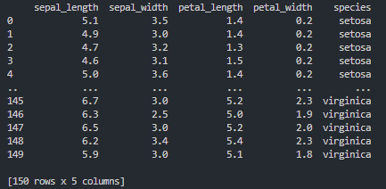
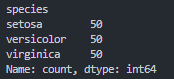
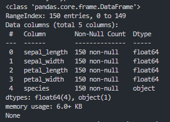
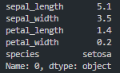
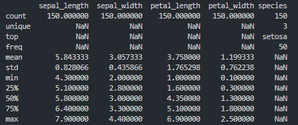
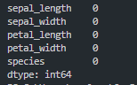
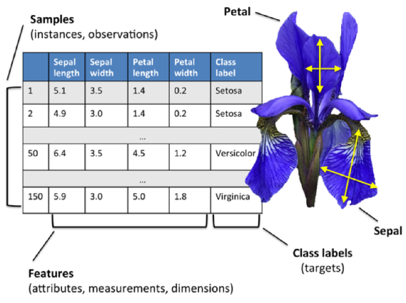

<h1 align="center">Higher Diploma in Science in Computing (Data Analytics)</h1>
<h1 align="center">Programming and Scripting - Iris Exploratory Data Project
</h1>

# Table of Contents
1. Introduction

2. Import Libraries

3. Load Data
    - 3.1 Load the Iris data
    - 3.2 How to run the Python code
    - 3.3 Check the top 5 rows
    - 3.4 Initial inspection of the data

4. Data Exploration
    - 4.1 Check for the DataFrame with pandas .info() method
    - 4.2 Selecting data by row numbers df.iloc() method
    - 4.3 Generate descriptive statistics with pandas .describe () method

5. Cleaning the Dataset
    - 5.1 Identify missing values

6. Data Analysis
    - 6.1 Univariate Analysis
      - 6.1.1 Histogram
        - 6.1.1.1   iris_histogram_petal_length.png
        - 6.1.1.2   iris_histogram_petal_width.png
        - 6.1.1.3   iris_histogram_sepal_length.png
        - 6.1.1.4   iris_histogram_sepal_width.png
      - 6.1.2 Box Plot
        - 6.1.2.1 iris_boxplot.png

    - 6.2 Bivariate Analysis
      - 6.2.1 Correlation Coefficients
        - 6.2.1.1 iris_heatmap.png
      - 6.2.2 Scatter Plots
        - 6.2.2.1 iris_scatterplot.png
            - Petal Width vs Petal Length
            - Sepal Width vs Sepal Length
      - 6.2.3 Kernel Density Estimate (KDE) Plot
        - 6.2.3.1 iris_line_chart_petal_length.png
        - 6.2.3.2 iris_line_chart_petal_width.png
        - 6.2.3.3 iris_line_chart_sepal_length.png
        - 6.2.3.4 iris_line_chart_sepal_width.png

7. Conclusion

8. About Author

9. List of references

# 1. Introduction

This repository contains my submission for the Programming and Scripting Project 2024 class project for the Programming and Scripting Module at ATU Galway as part of the Higher Diploma in Science in Data Analytics.
The goal of this project is to research the Iris data set and write documentation and code in Python to investigate it.

The Iris Dataset is renowned in the field of machine learning and statistics and is used for exploratory data analysis. The data set known as Fisher’s Iris data is a multivariate data set used and made famous by the British statistician and biologist [Ronald Fisher](https://en.wikipedia.org/wiki/Ronald_Fisher) in his 1936 paper "The use of multiple measurements in taxonomic problems as an example of linear discriminant analysis".

The data set consists of 50 samples from each of three species of Iris (*I. Setosa*, *I. Virginica* and *I. Versicolor*). Four features were measured from each sample: the length and the width of the sepals and petals, in centimeters. [[1]](https://en.wikipedia.org/wiki/Iris_flower_data_set)

###### [1] [Iris flower data set](https://en.wikipedia.org/wiki/Iris_flower_data_set)

###### [Picture credit:Pycodemates](https://blogger.googleusercontent.com/img/b/R29vZ2xl/AVvXsEimmGMPw0jM_8xjndEHLKj7Hf5fngvWFOJ6_V4jiFb-U0sCHej3aTu08htye1_BgUBGKfnszHoeI_OLLZVf6NjwaG9oDYyOqkjdjeDajd3zg8VuCLVTzDM8hO2XEnarwQeM-CLvFgAwfNX53GR_HPatNPkUH7-7FAoNgFKjw7ujB9LwW5piE8GIPLjJHw/s722/irir_flowers.png)

# 2. Imports Libraries

I imported the following libraries to analyse the dataset in Visual Studio Code.

- Pandas: Fundamental data analysis and manipulation library built on top of the Python programming language. It offers data structures and operations for manipulating numerical tables and time series. [[2]](https://www.w3schools.com/python/pandas/default.asp)
  
- NumPy: It contains functionality for multidimensional arrays, high-level mathematical functions such as linear algebra operations. [[3]](https://www.w3schools.com/python/numpy/default.asp)
  
- Matplotlib: Essential for creating static, animated, and interactive visualizations in Python. It is closely integrated with NumPy and provides a MATLAB-like interface for creating plots and visualizations. [[4]](https://www.w3schools.com/python/matplotlib_intro.asp)
  
- Seaborn: Seaborn provides a high-level interface for drawing attractive statistical graphics. [[5]](https://seaborn.pydata.org/)
  
- io: The io module  provides classes and functions for working with input and output streams, such as files, strings, and network connections, in a uniform way. [[6]](https://docs.python.org/3/library/io.html)

- warnings: to filter warning messages

###### [2] [Pandas Tutorial w3schools](https://www.w3schools.com/python/pandas/default.asp)

###### [3] [NumPy Tutorial w3schools ](https://www.w3schools.com/python/numpy/default.asp)

###### [4] [Matplotlib Tutorial w3schools](https://www.w3schools.com/python/matplotlib_intro.asp)

###### [5] [seaborn: statistical data visualization](https://seaborn.pydata.org/)

###### [6] [io: Core tools for working with streams](https://docs.python.org/3/library/io.html)

# 3. Load Data

## 3.1 Load the Iris data

### Rationale:
I need to load the data set from a URL. The dataset is available on [GitHub](https://raw.githubusercontent.com/mwaskom/seaborn-data/master/iris.csv)

### Findings:
The data is now loaded, time to check it and explore but first how to run the code. 

## 3.2 How to run the Python code

The following are required
 - Visual Studio Code: download from [here](https://code.visualstudio.com/download)
 - Github must be installed, get it [here](https://github.com/git-guides/install-git)
 - Clone this [repository](https://github.com/SBCURLEY/pands-project/blob/main/analysis.py) from Github by typing the command below: git clone
 - To run the Python script, first navigate to the Pands Folder > pands-project > analysis.py
 - The GitHub link is [here](https://github.com/SBCURLEY/pands-project/blob/main/analysis.py)
 - At the command line enter python the following
 
**$ python analysis.py**
 
The code will do the following:

 - Outputs a summary of each variable to a single text file called 'summary.txt'
  
 - Saves a histogram of each variable to .png files:
    - iris_histogram_petal_length.png
    - iris_histogram_petal_width.png
    - iris_histogram_sepal_length.png
    - iris_histogram_sepal_width.png
  
 - Outputs a scatter plot of each pair of variables to a .png files:
    - iris_scatterplot.png
  
 - Performs additional analysis to a .png files:
    - iris_boxplot.png
    - iris_heatmap.png
    - iris_line_chart_petal_length.png
    - iris_line_chart_petal_width.png
    - iris_line_chart_sepal_length.png
    - iris_line_chart_sepal_width.png

## 3.3 Check the top 5 rows

### Rationale:
I can display the top 5 rows of the DataFrame using the df.head function.

### Findings:
The column heading variables have the following names:
 - sepal_length:  Sepal length in cm.
 - sepal_width: Sepal width in cm.
 - petal_length:  Petal length in cm.
 - petal_width: Petal width in cm.
 - species.

### Statement & Sample Data:

print(df.head())

## 3.4 Initial inspection of the data

### Rationale:
I would like to have a quick look at the DataFrame as imported and determine how many species of Iris are contained in this dataset.
### Findings:
The data set contains 150 observations of iris flowers. There are four columns of measurements of the flowers in centimeters. The fifth column is the species of the flower observed. This dataset encompasses three species of iris flowers: *I. Setosa*, *I. Versicolor*, and *I. Virginica*, with 50 samples for each species.

### Statement & Sample Data:

print (df)

print (df["species"].value_counts())

# 4. Data Exploration

## 4.1 Check for the DataFrame with pandas .info() method

### Rationale:
The .info() method in Pandas provides valuable dimensional insights about the DataFrame. The information contains the number of columns, column labels, column data types, memory usage, range index, and the number of cells in each column (non-null values). The info() method does not return any value, it prints the information.[[7]](https://www.w3schools.com/python/pandas/ref_df_info.asp)

The output of the .info() method consists of several key components: [[8]](https://machinelearningtutorials.org/a-comprehensive-guide-to-using-the-pandas-dataframe-info-method/)
 - The total number of rows (entries) in the DataFrame.
 - A summary of each column, including:
    - The column name
    - The number of non-null values
    - The data type of the column
    - The memory usage of the column

df.info() was not displaying any result in st.write() so I had to reference the following to write df(info) to a txt file. This occurs because this pandas function doesn’t return anything back to Python which is why you get a value of None, it only prints.  [[9]](https://pandas.pydata.org/docs/reference/api/pandas.DataFrame.info.html) [[10]](https://discuss.streamlit.io/t/df-info-is-not-displaying-any-result-in-st-write/5100/2).

### Findings:
Upon review, I can gather the following information:
 - The DataFrame contains 150 rows and 5 columns.
 - The columns are: sepal_length, sepal_width,  petal_length, petal_width and  species.
 - No columns have non-null values, indicating that is no missing values in this dataset. 
 - Four quantitative variables are numeric with type 'float64':  sepal_length, sepal_width,  petal_length and petal_width. Numeric Variables provide detailed insights into each iris physical characteristics. They give me exact measurements for the physical attributes of the iris. Numerical values allow me to correlate between different characteristics in an exact and precise way.
 - One qualitative variable is categorical with type 'object': species. This attribute enable comprehensive analysis and comparison across the three species of iris. I can identify similarities between species, or patterns or variations that may exist within the dataset.
 - The memory usage of this DataFrame is approximately 6.0+ KB.
 - Show Counts: Whether to show non-null counts. None exist in this dataset.

The analysis will primarily focus on quantitative and quantitative types of variables. The quantitative values offer rich information, providing detailed insights into the dataset. Additionally, the quantitative variables allow for deeper dives into the data enhancing the depth of the analysis.

### Statement & Sample Data:
print (df.info())

###### [7] [Pandas DataFrame info() Method-w3schools](https://www.w3schools.com/python/pandas/ref_df_info.asp)

###### [8] [A Comprehensive Guide to Using the Pandas DataFrame .info() Method-Machine Learning Tutorials](https://machinelearningtutorials.org/a-comprehensive-guide-to-using-the-pandas-dataframe-info-method/)

###### [9] [pandas.DataFrame.info - Pandas Pydata](https://pandas.pydata.org/docs/reference/api/pandas.DataFrame.info.html)

###### [10] [Streamlit- Df.info() is not displaying any result in st.write()](https://discuss.streamlit.io/t/df-info-is-not-displaying-any-result-in-st-write/5100/2)

## 4.2 Selecting data by row numbers (.iloc)

### Rationale:
The iloc property gets, or sets, the value(s) of the specified indexes. It specifies both row and column with an index. In this example, I look at row 1 in detail. 
[[11]](https://pandas.pydata.org/pandas-docs/stable/reference/api/pandas.DataFrame.iloc.htm)

### Findings:
 - Row 1 is an I. Setosa flower.
 - Sepal Length is 5.1cm, sepal width is 3.5cm
 - Petal Length is 1.4cm, petal width is 0.2cm
  
### Statement & Sample Data:
Print (df.iloc[0])

###### [11] [pandas.DataFrame.iloc - Pandas Pydata](https://pandas.pydata.org/pandas-docs/stable/reference/api/pandas.DataFrame.iloc.html)

## 4.3 Generate descriptive statistics with pandas .describe method

### Rationale:
This analysis provides generalized descriptive statistics that summarises the central tendency of the data, the dispersion, and the shape of the dataset’s distribution. It also provides helpful information on missing NaN data if it exists. [[12]](https://www.pythonlore.com/exploring-pandas-dataframe-describe-for-descriptive-statistics/) [[13]](https://pandas.pydata.org/pandas-docs/version/0.20.2/generated/pandas.DataFrame.describe.html) By default, the describe() function only generates descriptive statistics for numeric columns in a pandas DataFrame. I am specifying include='all', which will force pandas to generate summaries for all columns in the DataFrame. 
The pandas .describe method includes the following statistics:
 - Count: count of rows
 - Unique: This will show the number of unique values in the column
 - Top: This will display the most common value in the column
 - Frequency: This will show the frequency of the top value within the column.
 - Mean: This will display the average value for each column.
 - Standard deviation: It indicates how spread out the values are around the mean. A higher standard deviation means the values are more spread out from the mean, while a lower standard deviation means the values are closer to the mean.
 - Minimum: It represents the lowest value in each column.
 - The default percentiles of the describe function are 25th, 50th, and 75th percentile or (0.25, 0.5, and 0.75).
 - First quartile (25th percentile): 25% of the data values are below this value.
 - Second quartile (50th percentile): It represents the median, the middle value of the dataset.
 - Third quartile (75th percentile): 75% of the data values are below this value.
 - Maximum: It represents the highest value in the dataset.

### Findings:
Key interpretations can be made from this function, both for the quantitative and qualitative data.
The count of rows does match the count of values for sepal_length, sepal_width,  petal_length and petal_width, thus indicating that there are no missing values. The species column contains three unique values, *I. Setosa* is the most popular species. Note also that the sepal length goes from 4.3cm up to 7.9cm and with a mean of 5.84cm.

### Statement & Sample Data:
df.describe(include="all")

###### [12] [Exploring pandas.DataFrame.describe for Descriptive Statistics-pythonlore](https://www.pythonlore.com/exploring-pandas-dataframe-describe-for-descriptive-statistics/)

###### [13] [pandas.DataFrame.describe-Pandas Pydata](https://pandas.pydata.org/pandas-docs/version/0.20.2/generated/pandas.DataFrame.describe.html)

# 5. Cleaning the Dataset

## 5.1 Identify missing data

### Rationale:
Before analysis, I must clean the dataset, this could involve removing rows with NaN values, dropping unnecessary or constant columns, and improving readability. Missing Data can occur when no information is provided for one or more items or for a whole unit. In Dataframes many datasets arrive with missing data, either because it exists and was not collected or it never existed. In this dataset, there are no NaN (an acronym for Not a Number)  entered. Nan is a special floating-point value recognized by all systems that use the standard IEEE floating-point representation [[14]](https://en.wikipedia.org/wiki/IEEE_754)
Firstly I have used the isnull() method to determine how may missing values are in the data set and identify them. [[15]](https://towardsdatascience.com/data-cleaning-with-python-and-pandas-detecting-missing-values-3e9c6ebcf78b)

###### [14] [IEEE 754: Wikipedia](https://en.wikipedia.org/wiki/IEEE_754)

###### [15] [Data Cleaning with Python and Pandas: Detecting Missing Values Toward Data Science](https://towardsdatascience.com/data-cleaning-with-python-and-pandas-detecting-missing-values-3e9c6ebcf78b)

### Findings:
There are zero missing values.

### Statement & Sample Data:

print(df.isnull().sum().sum())

print(df.isnull().sum())

# 6. Data Analysis
The data set consists of 50 samples from each of three species of Iris (*I. Setosa*, *I. Virginica* and *I. Versicolor*).
Four features were measured from each sample: the length and the width of the sepals and petals, in centimeters. Based on the combination of these four features, Fisher developed a linear discriminant model to distinguish the species from each other [[16]](https://www.bogotobogo.com/python/scikit-learn/scikit_machine_learning_features_extraction.php)

[Picture credit: Python Machine Learning by Sebastian Raschka, 2015](https://www.bogotobogo.com/python/scikit-learn/scikit_machine_learning_features_extraction.php) 

## 6.1 Univariate Analysis
A Univariate analysis focuses on understanding each variable in isolation. It is the simplest form of analysing data where each variable can be analysed separately. A Univariate analysis provides insights into the range, central tendency, dispersion, and shape of the distribution of each variable. [[17]](https://medium.com/@nomannayeem/mastering-exploratory-data-analysis-eda-a-comprehensive-python-pandas-guide-for-data-insights-c0be7c5b8889)

Techniques for Univariate Analysis:
- Histograms: Excellent for visually representing the distribution of a single continuous variable.
- Box Plots: Valuable for identifying outliers and grasping the data's dispersion.
- Count Plots: Ideal for categorical data, illustrating the frequency of each category.
- Pie Charts: Visually engaging method to display the proportion of categories within a variable.
- Bar Charts: Another effective means of depicting the frequency distribution of categorical data.

I will be using the Histogram and Box Plot techniques for this project.

[17] [Mastering Exploratory Data Analysis (EDA): A Comprehensive Python (Pandas) Guide for Data Insights and Storytelling](https://medium.com/@nomannayeem/mastering-exploratory-data-analysis-eda-a-comprehensive-python-pandas-guide-for-data-insights-c0be7c5b8889)

## 6.1.1 Histogram

### Rationale:
I created and saved a histogram of each variable to .png files, which will show the underlying frequency distribution (shape) of the Iris dataset, thus allowing the inspection of the data for its underlying distribution, outliers, skewness, etc. [[18]](https://realpython.com/python-histograms/) [[19]](https://www.datacamp.com/tutorial/histograms-matplotlib) [[20]](https://python-graph-gallery.com/190-custom-matplotlib-title/)

### Findings:
 - The below give me a clearer idea of the distribution of the data set.
 - The highest frequency of the petal length is around 37 which is between 1 and 2.
 - The highest frequency of the petal width is between 40 and 50 which is between 0.0 and 0.5.
 - The highest frequency of the sepal length is between 25 and 30 which is between 5.5 and 6.
 - The highest frequency of the sepal Width is around 35 and 40 which is between 3.0 and 3.5.
 - The histogram for the petal lengths show a clear group of observations having petal lengths that are much smaller than the rest of the observations and similarly so with the petal widths. One species is separated from the other two. 
 - The sepal lengths show quite a bit of variation with a number of peaks while sepal widths seem to be centred around 3 cms but with a few smaller peaks at both sides of 3 cm's - Normal Distribution

I used the following colours for each variable [[21]](https://www.statology.org/matplotlib-histogram-color/) [[22]](https://matplotlib.org/stable/gallery/color/named_colors.html)

 - petal_length: rebeccapurple
 - petal_width: palevioletred
 - sepal_length:  blueviolet
 - sepal_width:  fuchsia

#### 6.1.1.1 iris_histogram_petal_length.png

#### 6.1.1.2  iris_histogram_petal_width.png

#### 6.1.1.3  iris_histogram_sepal_length.png

#### .1.1.4  iris_histogram_sepal_width.png

###### [18] [Real Python: Python Histogram Plotting: NumPy, Matplotlib, pandas & Seaborn](https://realpython.com/python-histograms/)

###### [19] [Datacamp: Histograms in Matplotlib](https://www.datacamp.com/tutorial/histograms-matplotlib)

###### [20] [Python Graph Gallery-Custom Matplotlib Title](https://python-graph-gallery.com/190-custom-matplotlib-title/)

###### [21] [Statology: How to Modify a Matplotlib Histogram Color (With Examples](https://www.statology.org/matplotlib-histogram-color/)

###### [22] [List of named colours - matplotlib](https://matplotlib.org/stable/gallery/color/named_colors.html)

## 6.1.2  Box Plot
### Rationale:
### Findings:

## 6.2 Bivariate Analysis
## 6.2.1 Correlation Coefficients
### Rationale:
### Findings:

## 6.2.2 Scatter Plot
### Rationale:
### Findings:

## 6.2.3 Kernel Density Estimate (KDE) Plot
### Rationale:
### Findings:

# 7. Conclusion

# 8. About Author

# 9. Reference List

### About this Project
What the project does

The iris data consisted of 150 samples of three species of Iris. The first column represents sepal length, the second column represents sepal width, the third column represents petal length, and the fourth column represents petal width. The picture of the Iris species is given below:

The iris species look similar, but the difference in measurements can be used to classify them. The input variables are sepal length and width and petal length and width; each row represents an instance or observation. The output variable is species - setosa, versicolor, or virginica.

### Use of this Project
Why the project is useful

### Get Started
How users can get started with the project

### Get Help
Where users can get help with your project

## Git Hub Repository Links
[pands-project](https://github.com/SBCURLEY/pands-project)

## Built With
pandas - used to perform data manipulation and analysis

numpy - used to perform a wide variety of mathematical operations on arrays

matplotlib - used for data visualization and graphical plotting

## Author
**By Sharon Curley**

I work at [Meissner](https://www.meissner.com/) as a Business Systems Analyst.

Research Readme's

https://docs.github.com/en/repositories/managing-your-repositorys-settings-and-features/customizing-your-repository/about-readmes

https://www.freecodecamp.org/news/how-to-write-a-good-readme-file/

https://dev.to/rohit19060/how-to-write-stunning-github-readme-md-template-provided-5b09

RESEARCH

Python – Basics of Pandas using Iris Dataset    https://www.geeksforgeeks.org/python-basics-of-pandas-using-iris-dataset/

Iris Dataset Classification with Python: A Tutorial     https://www.pycodemates.com/2022/05/iris-dataset-classification-with-python.html    PICTURE : IRIS SPECIES

Iris Dataset Analysis using Python | Classification | Machine Learning Project Tutorial       https://www.hackersrealm.net/post/iris-dataset-analysis-using-python   VIDEO

Exploratory Data Analysis : Iris Dataset        https://medium.com/analytics-vidhya/exploratory-data-analysis-iris-dataset-4df6f045cda

First step to Statistics (with Iris data)       https://medium.com/analytics-vidhya/first-step-to-statistics-with-iris-data-3d29c0820c5d

[Data Analysis] Cleaning data (4/11)            https://medium.com/@SamTaylor92/data-analysis-exploring-a-dataset-cleaning-data-19562be6cd0a

Iris Dataset                                    https://www.ritchieng.com/machine-learning-iris-dataset/     PICTURE : IRIS ATTRIBUTES

Analyzing Iris Data                    https://github.com/Sahilll94/Analyzing-Iris-Dataset-/blob/main/Analyzing%20Iris%20Data.ipynb       GREAT ANALYSIS!

How to align images in markdown         https://davidwells.io/snippets/how-to-align-images-in-markdown