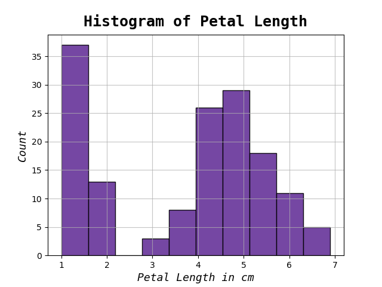
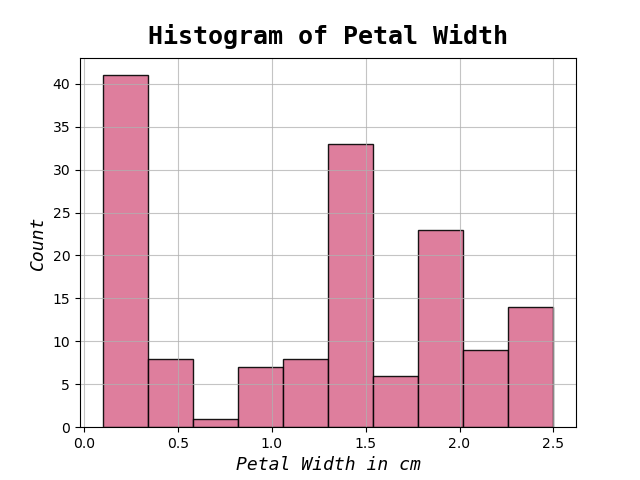
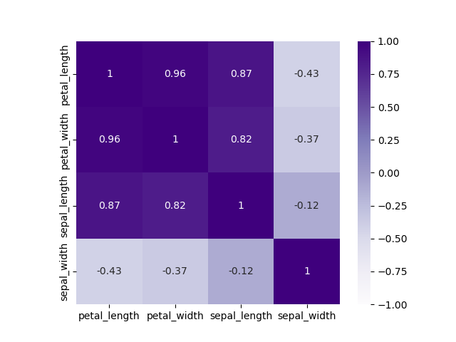
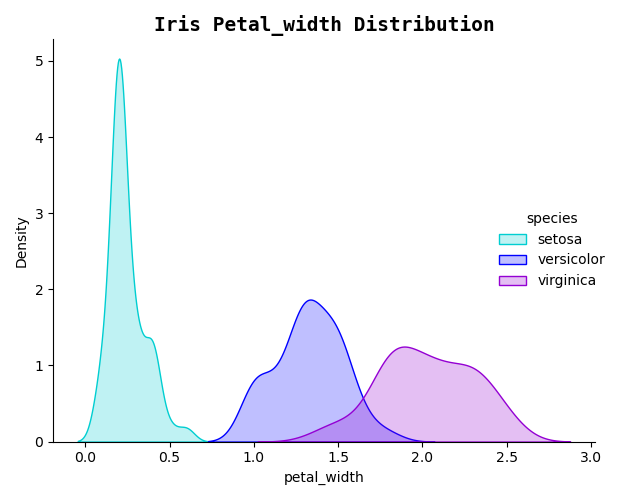

<h1 align="center">Higher Diploma in Science in Computing (Data Analytics)</h1>
<h1 align="center">Programming and Scripting - Iris Exploratory Data Project
</h1>

# Table of Contents
1. Introduction

2. Import Libraries

3. Load Data
    - 3.1 Load the Iris data
    - 3.2 How to run the Python code
    - 3.3 Check the top 5 rows
    - 3.4 Initial inspection of the data

4. Data Exploration
    - 4.1 Check for the DataFrame with pandas .info() method
    - 4.2 Selecting data by row numbers df.iloc() method
    - 4.3 Generate descriptive statistics with pandas .describe () method

5. Cleaning the Dataset
    - 5.1 Identify missing values

6. Data Analysis
    - 6.1 Univariate Analysis
      - 6.1.1 Histogram
        - 6.1.1.1   iris_histogram_petal_length.png
        - 6.1.1.2   iris_histogram_petal_width.png
        - 6.1.1.3   iris_histogram_sepal_length.png
        - 6.1.1.4   iris_histogram_sepal_width.png
      - 6.1.2 Box Plot
        - 6.1.2.1 iris_boxplot.png

    - 6.2 Bivariate Analysis
      - 6.2.1 Correlation Coefficients
        - 6.2.1.1 iris_heatmap.png
      - 6.2.2 Scatter Plots
        - 6.2.2.1 iris_scatterplot.png
            - Petal Width vs Petal Length
            - Sepal Width vs Sepal Length
      - 6.2.3 Kernel Density Estimate (KDE) Plot
        - 6.2.3.1 iris_line_chart_petal_length.png
        - 6.2.3.2 iris_line_chart_petal_width.png
        - 6.2.3.3 iris_line_chart_sepal_length.png
        - 6.2.3.4 iris_line_chart_sepal_width.png

7. Conclusion

8. About Author

9. List of references

# 1. Introduction

This repository contains my project submission for the Programming and Scripting Module at ATU Galway as part of the Higher Diploma in Science in Data Analytics.
The goal of this project is to research the Iris data set and write documentation and code in Python to investigate it.

The Iris Dataset is renowned in the field of machine learning and statistics and is used for exploratory data analysis. The data set known as Fisher’s Iris data is a multivariate data set used and made famous by the British statistician and biologist [Ronald Fisher](https://en.wikipedia.org/wiki/Ronald_Fisher) in his 1936 paper "The use of multiple measurements in taxonomic problems as an example of linear discriminant analysis".

The data set consists of 50 samples from each of three species of Iris (*I. Setosa*, *I. Virginica* and *I. Versicolor*). Four features were measured from each sample: the length and the width of the sepals and petals, in centimeters. [[1]](https://en.wikipedia.org/wiki/Iris_flower_data_set)

###### [1] [Iris flower data set](https://en.wikipedia.org/wiki/Iris_flower_data_set)

###### [Picture credit:Pycodemates](https://blogger.googleusercontent.com/img/b/R29vZ2xl/AVvXsEimmGMPw0jM_8xjndEHLKj7Hf5fngvWFOJ6_V4jiFb-U0sCHej3aTu08htye1_BgUBGKfnszHoeI_OLLZVf6NjwaG9oDYyOqkjdjeDajd3zg8VuCLVTzDM8hO2XEnarwQeM-CLvFgAwfNX53GR_HPatNPkUH7-7FAoNgFKjw7ujB9LwW5piE8GIPLjJHw/s722/irir_flowers.png)

# 2. Imports Libraries

I imported the following libraries to analyse the dataset in Visual Studio Code.

- Pandas: Fundamental data analysis and manipulation library built on top of the Python programming language. It offers data structures and operations for manipulating numerical tables and time series. [[2]](https://www.w3schools.com/python/pandas/default.asp)
  
- NumPy: It contains functionality for multidimensional arrays, high-level mathematical functions such as linear algebra operations. [[3]](https://www.w3schools.com/python/numpy/default.asp)
  
- Matplotlib: Essential for creating static, animated, and interactive visualizations in Python. It is closely integrated with NumPy and provides a MATLAB-like interface for creating plots and visualizations. [[4]](https://www.w3schools.com/python/matplotlib_intro.asp)
  
- Seaborn: Seaborn provides a high-level interface for drawing attractive statistical graphics. [[5]](https://seaborn.pydata.org/)
  
- io: The io module  provides classes and functions for working with input and output streams, such as files, strings, and network connections, in a uniform way. [[6]](https://docs.python.org/3/library/io.html)

- warnings: to filter warning messages

###### [2] [Pandas Tutorial w3schools](https://www.w3schools.com/python/pandas/default.asp)

###### [3] [NumPy Tutorial w3schools ](https://www.w3schools.com/python/numpy/default.asp)

###### [4] [Matplotlib Tutorial w3schools](https://www.w3schools.com/python/matplotlib_intro.asp)

###### [5] [seaborn: statistical data visualization](https://seaborn.pydata.org/)

###### [6] [io: Core tools for working with streams](https://docs.python.org/3/library/io.html)

# 3. Load Data

## 3.1 Load the Iris data

### Rationale:
I need to load the data set from a URL. The dataset is available on [GitHub](https://raw.githubusercontent.com/mwaskom/seaborn-data/master/iris.csv)

### Findings:
The data is now loaded, time to check it and explore but first how to run the code. 

## 3.2 How to run the Python code

The following are required
 - Visual Studio Code: download from [Visual Studio.com](https://code.visualstudio.com/download)
 - Github must be installed, get it at [Git Hub.com](https://github.com/git-guides/install-git)
 - Clone this [repository](https://github.com/SBCURLEY/pands-project/blob/main/analysis.py) from Github by typing the command: git clone in VS Code
 - To run the Python script, first navigate to the Pands Folder > pands-project > analysis.py
 - The GitHub link is [here](https://github.com/SBCURLEY/pands-project/blob/main/analysis.py)
 - At the command line enter the following command
 
**$ python analysis.py**
 
The code will do the following:

 - Outputs a summary of each variable to a single text file called 'summary.txt'
  
 - Saves a histogram of each variable to .png files:
    - iris_histogram_petal_length.png
    - iris_histogram_petal_width.png
    - iris_histogram_sepal_length.png
    - iris_histogram_sepal_width.png
  
 - Outputs a scatter plot of each pair of variables to a .png files:
    - iris_scatterplot.png
  
 - Performs additional analysis to a .png files:
    - iris_boxplot.png
    - iris_heatmap.png
    - iris_line_chart_petal_length.png
    - iris_line_chart_petal_width.png
    - iris_line_chart_sepal_length.png
    - iris_line_chart_sepal_width.png

## 3.3 Check the top 5 rows

### Rationale:
I can display the top 5 rows of the DataFrame using the df.head function.

### Findings:
The column heading variables have the following names:
 - sepal_length:  Sepal length in cm.
 - sepal_width: Sepal width in cm.
 - petal_length:  Petal length in cm.
 - petal_width: Petal width in cm.
 - species.

### Statement & Sample Data:

print(df.head())

## 3.4 Initial inspection of the data

### Rationale:
I would like to have a quick look at the DataFrame as imported and determine how many species of Iris are contained in this dataset.
### Findings:
The data set contains 150 observations of iris flowers. There are four columns of measurements of the flowers in centimeters. The fifth column is the species of the flower observed. This dataset encompasses three species of iris flowers: *I. Setosa*, *I. Versicolor*, and *I. Virginica*, with 50 samples for each species.

### Statement & Sample Data:

print (df)

print (df["species"].value_counts())

# 4. Data Exploration

## 4.1 Check for the DataFrame with pandas .info() method

### Rationale:
The .info() method in Pandas provides valuable dimensional insights about the DataFrame. The information contains the number of columns, column labels, column data types, memory usage, range index, and the number of cells in each column (non-null values). The info() method does not return any value, it prints the information.[[7]](https://www.w3schools.com/python/pandas/ref_df_info.asp)

The output of the .info() method consists of several key components: [[8]](https://machinelearningtutorials.org/a-comprehensive-guide-to-using-the-pandas-dataframe-info-method/)
 - The total number of rows (entries) in the DataFrame.
 - A summary of each column, including:
    - The column name
    - The number of non-null values
    - The data type of the column
    - The memory usage of the column

df.info() was not displaying any result in st.write() so I had to reference the following to write df(info) to a txt file. This occurs because this pandas function doesn’t return anything back to Python which is why you get a value of None, it only prints.  [[9]](https://pandas.pydata.org/docs/reference/api/pandas.DataFrame.info.html) [[10]](https://discuss.streamlit.io/t/df-info-is-not-displaying-any-result-in-st-write/5100/2).

### Findings:
Upon review, I can gather the following information:
 - The DataFrame contains 150 rows and 5 columns.
 - The columns are: sepal_length, sepal_width,  petal_length, petal_width and  species.
 - No columns have non-null values, indicating that is no missing values in this dataset. 
 - Four quantitative variables are numeric with type 'float64':  sepal_length, sepal_width,  petal_length and petal_width. Numeric Variables provide detailed insights into each iris physical characteristics. They give me exact measurements for the physical attributes of the iris. Numerical values allow me to correlate between different characteristics in an exact and precise way.
 - One qualitative variable is categorical with type 'object': species. This attribute enable comprehensive analysis and comparison across the three species of iris. I can identify similarities between species, or patterns or variations that may exist within the dataset.
 - The memory usage of this DataFrame is approximately 6.0+ KB.
 - Show Counts: Whether to show non-null counts. None exist in this dataset.

The analysis will primarily focus on quantitative and quantitative types of variables. The quantitative values offer rich information, providing detailed insights into the dataset. Additionally, the quantitative variables allow for deeper dives into the data enhancing the depth of the analysis.

### Statement & Sample Data:
print (df.info())

###### [7] [Pandas DataFrame info() Method-w3schools](https://www.w3schools.com/python/pandas/ref_df_info.asp)

###### [8] [A Comprehensive Guide to Using the Pandas DataFrame .info() Method-Machine Learning Tutorials](https://machinelearningtutorials.org/a-comprehensive-guide-to-using-the-pandas-dataframe-info-method/)

###### [9] [pandas.DataFrame.info - Pandas Pydata](https://pandas.pydata.org/docs/reference/api/pandas.DataFrame.info.html)

###### [10] [Streamlit- Df.info() is not displaying any result in st.write()](https://discuss.streamlit.io/t/df-info-is-not-displaying-any-result-in-st-write/5100/2)

## 4.2 Selecting data by row numbers (.iloc)

### Rationale:
The iloc property gets, or sets, the value(s) of the specified indexes. It specifies both row and column with an index. In this example, I look at row 1 in detail. 
[[11]](https://pandas.pydata.org/pandas-docs/stable/reference/api/pandas.DataFrame.iloc.html)

### Findings:
 - Row 1 is an *I. Setosa* flower.
 - Sepal Length is 5.1cm, sepal width is 3.5cm
 - Petal Length is 1.4cm, petal width is 0.2cm
  
### Statement & Sample Data:
Print (df.iloc[0])

###### [11] [pandas.DataFrame.iloc - Pandas Pydata](https://pandas.pydata.org/pandas-docs/stable/reference/api/pandas.DataFrame.iloc.html)

## 4.3 Generate descriptive statistics with pandas .describe method

### Rationale:
This analysis provides generalized descriptive statistics that summarises the central tendency of the data, the dispersion, and the shape of the dataset’s distribution. It also provides helpful information on missing NaN data if it exists. [[12]](https://www.pythonlore.com/exploring-pandas-dataframe-describe-for-descriptive-statistics/) [[13]](https://pandas.pydata.org/pandas-docs/version/0.20.2/generated/pandas.DataFrame.describe.html) By default, the describe() function only generates descriptive statistics for numeric columns in a pandas DataFrame. I am specifying include='all', which will force pandas to generate summaries for all columns in the DataFrame. 
The pandas .describe method includes the following statistics:
 - Count: count of rows
 - Unique: This will show the number of unique values in the column
 - Top: This will display the most common value in the column
 - Frequency: This will show the frequency of the top value within the column.
 - Mean: This will display the average value for each column.
 - Standard deviation: It indicates how spread out the values are around the mean. A higher standard deviation means the values are more spread out from the mean, while a lower standard deviation means the values are closer to the mean.
 - Minimum: It represents the lowest value in each column.
 - The default percentiles of the describe function are 25th, 50th, and 75th percentile or (0.25, 0.5, and 0.75).
 - First quartile (25th percentile): 25% of the data values are below this value.
 - Second quartile (50th percentile): It represents the median, the middle value of the dataset.
 - Third quartile (75th percentile): 75% of the data values are below this value.
 - Maximum: It represents the highest value in the dataset.

### Findings:
Key interpretations can be made from this function, both for the quantitative and qualitative data.
The count of rows does match the count of values for sepal_length, sepal_width,  petal_length and petal_width, thus indicating that there are no missing values. The species column contains three unique values, *I. Setosa* is the most popular species. Note also that the sepal length goes from 4.3cm up to 7.9cm and with a mean of 5.84cm.

### Statement & Sample Data:
df.describe(include="all")

###### [12] [Exploring pandas.DataFrame.describe for Descriptive Statistics-pythonlore](https://www.pythonlore.com/exploring-pandas-dataframe-describe-for-descriptive-statistics/)

###### [13] [pandas.DataFrame.describe-Pandas Pydata](https://pandas.pydata.org/pandas-docs/version/0.20.2/generated/pandas.DataFrame.describe.html)

# 5. Cleaning the Dataset

## 5.1 Identify missing data

### Rationale:
Before analysis, I must clean the dataset, this could involve removing rows with NaN values, dropping unnecessary or constant columns, and improving readability. Missing Data can occur when no information is provided for one or more items or for a whole unit. In Dataframes many datasets arrive with missing data, either because it exists and was not collected or it never existed. In this dataset, there are no NaN (an acronym for Not a Number)  entered. Nan is a special floating-point value recognized by all systems that use the standard IEEE floating-point representation [[14]](https://en.wikipedia.org/wiki/IEEE_754)
From previous analysis above, there does not appear to be missing values but I will check by using the isnull() method. This will determine how many missing values are in the data set and identify them if they exist. [[15]](https://towardsdatascience.com/data-cleaning-with-python-and-pandas-detecting-missing-values-3e9c6ebcf78b)

###### [14] [IEEE 754: Wikipedia](https://en.wikipedia.org/wiki/IEEE_754)

###### [15] [Data Cleaning with Python and Pandas: Detecting Missing Values Toward Data Science](https://towardsdatascience.com/data-cleaning-with-python-and-pandas-detecting-missing-values-3e9c6ebcf78b)

### Findings:
There are zero missing values.

### Statement & Sample Data:

print(df.isnull().sum().sum())

print(df.isnull().sum())

# 6. Data Analysis
The data set consists of 50 samples from each of three species of Iris (*I. Setosa*, *I. Virginica* and *I. Versicolor*).
Four features were measured from each sample: the length and the width of the sepals and petals, in centimeters. Based on the combination of these four features, Fisher developed a linear discriminant model to distinguish the species from each other [[16]](https://www.bogotobogo.com/python/scikit-learn/scikit_machine_learning_features_extraction.php)

[Picture credit: Python Machine Learning by Sebastian Raschka, 2015](https://www.bogotobogo.com/python/scikit-learn/scikit_machine_learning_features_extraction.php) 

###### [16] [Machine Learning](https://www.bogotobogo.com/python/scikit-learn/scikit_machine_learning_features_extraction.php)

## 6.1 Univariate Analysis
A Univariate analysis focuses on understanding each variable in isolation. It is the simplest form of analysing data where each variable can be analysed separately. A Univariate analysis provides insights into the range, central tendency, dispersion, and shape of the distribution of each variable. [[17]](https://medium.com/@nomannayeem/mastering-exploratory-data-analysis-eda-a-comprehensive-python-pandas-guide-for-data-insights-c0be7c5b8889)

Techniques for Univariate Analysis:
- Histograms: Excellent for visually representing the distribution of a single continuous variable.
- Box Plots: Valuable for identifying outliers and grasping the data's dispersion.
- Count Plots: Ideal for categorical data, illustrating the frequency of each category.
- Pie Charts: Visually engaging method to display the proportion of categories within a variable.
- Bar Charts: Another effective means of depicting the frequency distribution of categorical data.

I will be exploring the Histogram and Box Plot techniques for this project.

[17] [Mastering Exploratory Data Analysis (EDA): A Comprehensive Python (Pandas) Guide for Data Insights and Storytelling](https://medium.com/@nomannayeem/mastering-exploratory-data-analysis-eda-a-comprehensive-python-pandas-guide-for-data-insights-c0be7c5b8889)

## 6.1.1 Histogram

### Rationale:
I created and saved a histogram of each variable to .png files, which will show the underlying frequency distribution (shape) of the Iris dataset, thus allowing the inspection of the data for its underlying distribution, outliers, skewness, etc. [[18]](https://realpython.com/python-histograms/) [[19]](https://www.datacamp.com/tutorial/histograms-matplotlib) [[20]](https://python-graph-gallery.com/190-custom-matplotlib-title/)

### Findings:
 - The following graphs give me a clearer idea of the distribution of the data set.
 - The highest frequency of the petal length is around 37 which is between 1 and 2.
 - The highest frequency of the petal width is between 40 and 50 which is between 0.0 and 0.5.
 - The highest frequency of the sepal length is between 25 and 30 which is between 5.5 and 6.
 - The highest frequency of the sepal Width is around 35 and 40 which is between 3.0 and 3.5.
 - The histogram for the petal lengths show a clear group of observations having petal lengths that are much smaller than the rest of the observations and similarly so with the petal widths. One species is separated from the other two. 
 - The sepal lengths show quite a bit of variation with a number of peaks while sepal widths seem to be centred around 3 cms but with a few smaller peaks at both sides of 3 cm's - Normal Distribution

I used the following colours for each variable [[21]](https://www.statology.org/matplotlib-histogram-color/) [[22]](https://matplotlib.org/stable/gallery/color/named_colors.html)

 - petal_length: rebeccapurple
 - petal_width: palevioletred
 - sepal_length:  blueviolet
 - sepal_width:  fuchsia

#### 6.1.1.1 iris_histogram_petal_length.png

#### 6.1.1.2  iris_histogram_petal_width.png

#### 6.1.1.3  iris_histogram_sepal_length.png

#### 6.1.1.4  iris_histogram_sepal_width.png

###### [18] [Real Python: Python Histogram Plotting: NumPy, Matplotlib, pandas & Seaborn](https://realpython.com/python-histograms/)

###### [19] [Datacamp: Histograms in Matplotlib](https://www.datacamp.com/tutorial/histograms-matplotlib)

###### [20] [Python Graph Gallery-Custom Matplotlib Title](https://python-graph-gallery.com/190-custom-matplotlib-title/)

###### [21] [Statology: How to Modify a Matplotlib Histogram Color (With Examples](https://www.statology.org/matplotlib-histogram-color/)

###### [22] [List of named colours - matplotlib](https://matplotlib.org/stable/gallery/color/named_colors.html)

## 6.1.2  Box Plot

### Rationale:
A boxplot is a very helpful plot as it shows various statistics in one plot, including the minimum, median, quartiles, interquartile range, outliers etc. The interquartile range (IQR) is the middle 50% of the data and can show the spread of the data. The whiskers show if the data is skewed in one direction or the other. The median is the line through the box. Outliers are generally classified as being outside 1.5 times the interquartile range.

The boxplots below are generated using the [Seaborn](https://seaborn.pydata.org/tutorial/introduction) library and generates comparison of each species. [[23]](https://seaborn.pydata.org/generated/seaborn.boxplot.html) [[24]](https://www.geeksforgeeks.org/boxplot-using-seaborn-in-python/) [[25]](https://datagy.io/seaborn-boxplot/)

### Findings:
 - The boxplot below is very useful plot for clearly showing the differences in the distributions of the measurements across the three Iris species in the dataset. 
 - The  *I. Setosa* stands out from the other two species as having much smaller petal dimensions . 
 - The *I. Setosa* petal length and width dataset seems to be quite clustered, especially compared to the other two species of *Iris Versicolor* and *Iris Virginica* making them valuable for classification.

#### 6.1.2.1  iris_boxplot.png

###### [23] [Seaborn Boxplot](https://seaborn.pydata.org/generated/seaborn.boxplot.html)

###### [24] [Boxplot using Seaborn in Python - Geeks for Geeks](https://www.geeksforgeeks.org/boxplot-using-seaborn-in-python/)

###### [25] [Seaborn Boxplot – How to Create Box and Whisker Plots-datagy.io](https://datagy.io/seaborn-boxplot/)

## 6.2 Bivariate Analysis
The term bivariate analysis refers to the analysis of two variables. The purpose of a bivariate analysis is to understand the relationship between the two variables. [[26]](https://www.statology.org/bivariate-analysis-in-python/)

There are four common ways to perform bivariate analysis:
  1. Correlation Coefficients
  2. Scatterplots
  3. Simple Linear Regression
  4. Bar Chart visualised using a stacked bar chart.

I will focus on three for this project.

[26] [How to Perform Bivariate Analysis in Python (With Examples)-Statology](https://www.statology.org/bivariate-analysis-in-python/)

## 6.2.1 Correlation Coefficients

### Rationale:
Correlation measures both the strength and direction of the linear relationship between two variables. A coefficient of correlation is a value between -1 and +1 that denotes both the strength and directionality of a relationship between two variables. I can start this analysis by determining if there is a positive correlation between attributes. [[27]](https://towardsdatascience.com/let-us-understand-the-correlation-matrix-and-covariance-matrix-d42e6b643c22#:~:text=In%20simple%20words%2C%20both%20the,linear%20relationship%20between%20two%20variables)  [[28]](https://datagy.io/python-correlation-matrix/)

### Findings:
To summarize the results below
 - a high positive correlation between Petal Width and Petal Length (0.96)
 - a high positive correlation between Petal Length and Sepal Length (0.87)
 - a high positive correlation between Petal Width and Sepal Length (0.81)

From the above data, I can determine correlations between these main variables: Petal Width, Petal Length and Sepal Length.
 - Theory - PCC (Pearson correlation coefficient) is: [[29]](https://realpython.com/numpy-scipy-pandas-correlation-python/#pearson-correlation-coefficient)
    - 1 is total positive linear correlation
    - 0 is no linear correlation
    - −1 is total negative linear correlation

The above results could be displayed on a heatmap using the [Seaborn](https://seaborn.pydata.org/tutorial/introduction) library heatmap function 
as follows [[30]](https://www.w3schools.com/datascience/ds_stat_correlation_matrix.asp). The above observations are clearer with a heatmap.

###### [27] [Towards Data Science: Baffled by Covariance and Correlation](https://towardsdatascience.com/let-us-understand-the-correlation-matrix-and-covariance-matrix-d42e6b643c22#:~:text=In%20simple%20words%2C%20both%20the,linear%20relationship%20between%20two%20variables)

###### [28] [Datagy:Calculate and Plot a Correlation Matrix in Python and Pandas](https://datagy.io/python-correlation-matrix/)

###### [29] [NumPy, SciPy, and pandas: Correlation With Python-Real Python](https://realpython.com/numpy-scipy-pandas-correlation-python/#pearson-correlation-coefficient)

###### [30] [Data Science - Statistics Correlation Matrix - w3schools](https://www.w3schools.com/datascience/ds_stat_correlation_matrix.asp)

## 6.2.2 Scatter Plot

### Rationale:
A scatter plot is a useful plot as it visually shows how the different variables or features in the data set correlate with one another. I have created two scatterplot diagrams showing the distribution of:

 - Sepal Length and Width
 - Petal Length and Width

across the three species of Iris. [[31]](https://realpython.com/visualizing-python-plt-scatter/)

### Findings:
In the scatterplot diagrams below [[32]](https://matplotlib.org/stable/api/_as_gen/matplotlib.pyplot.scatter.html) [[33]](https://www.w3schools.com/python/matplotlib_scatter.asp), it's evident that *I. Setosa* stands out distinctly from the other two species due to its linear separability, particularly noticeable in the analysis of sepal length and width. This separability arises from the significantly smaller petal length and width of *I. Setosa* compared to the other species, leading to minimal overlap between them in the scatterplots. [[34]](https://stackoverflow.com/questions/42818361/how-to-make-two-plots-side-by-side)

On the other hand, distinguishing between *I. Virginica* and *I. Versicolor* based on this dataset proves to be more challenging, as indicated by the close proximity and overlapping clusters in the diagrams. However, it's worth noting that *I. Virginica* generally exhibits slightly longer petal lengths compared to *I. Versicolor* and notably longer ones compared to *I. Setosa*.

#### 6.1.2.1  iris_scatterplot.png

###### [31] [Real Python- Visualizing Data in Python Using plt.scatter()](https://realpython.com/visualizing-python-plt-scatter/)

###### [32] [matplotlib.pyplot.scatter - matplotlib.org](https://matplotlib.org/stable/api/_as_gen/matplotlib.pyplot.scatter.html)

###### [33] [Matplotlib Scatter - Creating Scatter Plots - w3schools](https://www.w3schools.com/python/matplotlib_scatter.asp)

###### [34] [Stack Overflow: How to make two plots side-by-side](https://stackoverflow.com/questions/42818361/how-to-make-two-plots-side-by-side)

## 6.2.3 Kernel Density Estimate (KDE) Plot

### Rationale:
A Kernel Density Estimate (KDE) plot is a visualization technique that offers a detailed view of the probability density of continuous variables.  [[35]](https://seaborn.pydata.org/generated/seaborn.kdeplot.html) [[36]](https://www.geeksforgeeks.org/kde-plot-visualization-with-pandas-and-seaborn/). I will be using the [Seaborn](https://seaborn.pydata.org/tutorial/introduction) library for this analysis.

### Findings:
I can see again how these features differ in size and how *I. Versicolor* and *I. Virginica* are related to each other.
By comparing the species [[37]](https://seaborn.pydata.org/generated/seaborn.set_style.html) using a line curve, it is observed that the feature sepal is not sufficient to distinguish *I. Versicolor* from *I. Virginica*. On the other hand, it is very clear how *I. Setosa* can be easily distinguished from *I. Versicolor* and *I. Virginica*. [[38]](https://www.digitalocean.com/community/tutorials/seaborn-kdeplot)

#### 6.2.3.1  iris_line_chart_petal_length.png

#### 6.2.3.2  iris_line_chart_petal_width.png

#### 6.2.3.3  iris_line_chart_sepal_length.png

#### 6.2.3.4  iris_line_chart_sepal_width.png

###### [35] [seaborn.kdeplot - Seaborn](https://seaborn.pydata.org/generated/seaborn.kdeplot.html)

###### [36] [KDE Plot Visualization with Pandas and Seaborn - geeksforgeeks](https://www.geeksforgeeks.org/kde-plot-visualization-with-pandas-and-seaborn/)

###### [37] [seaborn.set_style — seaborn 0.13.2 documentation](https://seaborn.pydata.org/generated/seaborn.set_style.html)

###### [38] [Seaborn Kdeplot - A Comprehensive Guide - Digital Ocean](https://www.digitalocean.com/community/tutorials/seaborn-kdeplot)

# 7. Conclusion

The analysis of the Fisher's Iris dataset reveals how valuable it is for training machine learning algorithms for pattern recognition and clustering. It highlights two distinct clusters within the data: a larger cluster comprising an overlap of data points from *I. Versicolor* and *I. Virginia*, and a smaller cluster consisting solely of *I. Setosa*. This clustering is evident in both scatter matrix plots, line plots and statistical analysis, indicating less distinction between iris species within the larger cluster.

The project allowed for the integration of various Python libraries and skills acquired during the lectures and weekly tasks since January '24. It follows a journey for me from zero coding experience to a deeper understanding of Python's capabilities. This project demonstrates Python's efficiency in handling large datasets compared to traditional tools like Excel which I would be familiar with. It increased my confidence in approaching machine learning projects. Overall, the project highlights the power of data analytics, showcasing how seemingly simple datasets, such as the Iris dataset, can yield profound insights when analysed comprehensively. I really enjoyed the journey and looking forward to the next leg of it.

# 8. About Author
- Sharon Curley
  
    My role is a Business Systems Analyst for [Meissner Corporation](https://www.meissner.com/) - a manufacturing company in Castlebar, Co. Mayo. The systems I am supporting currently are Microsoft Dynamics 365 (ERP) for all Meissner entities (Ireland, US, Switzerland, Germany & Italy). I initially started out in functional areas like Customer Service & Supply Chain as I was lucky to be one of the first crew members on board in this company in 2020. I have moved into the IT Dept since March last year. I have a background in SAP - projects & support, so was drawn back into this area when I saw the opportunity arise within Meissner. I have a keen interest in data as when I was a functional user that was the most frustrating part of my role - trying to get meaningful data from the systems we use. I have used excel to an advanced level and started with Power BI. I see a lot of opportunities within Meissner to develop in the Data area.

- [Git Hub Profile](https://github.com/SBCURLEY "Sharon Curley")

- [Email](mailto:G00438863@atu.ie?subject=Hi "Hi!")

# 9. Reference List

###### [1] [Iris flower data set]( https://en.wikipedia.org/wiki/Iris_flower_data_set)

###### [2] [Pandas Tutorial w3schools]( https://www.w3schools.com/python/pandas/default.asp)

###### [3] [NumPy Tutorial w3schools ]( https://www.w3schools.com/python/numpy/default.asp)

###### [4] [Matplotlib Tutorial w3schools](https://www.w3schools.com/python/matplotlib_intro.asp)

###### [5] [seaborn: statistical data visualization](https://seaborn.pydata.org/)

###### [6] [io: Core tools for working with streams](https://docs.python.org/3/library/io.html)

###### [7] [Pandas DataFrame info() Method-w3schools](https://www.w3schools.com/python/pandas/ref_df_info.asp)

###### [8] [A Comprehensive Guide to Using the Pandas DataFrame .info() Method-Machine Learning Tutorials](https://machinelearningtutorials.org/a-comprehensive-guide-to-using-the-pandas-dataframe-info-method/)

###### [9] [pandas.DataFrame.info - Pandas Pydata](https://pandas.pydata.org/docs/reference/api/pandas.DataFrame.info.html)

###### [10] [Streamlit- Df.info() is not displaying any result in st.write()](https://discuss.streamlit.io/t/df-info-is-not-displaying-any-result-in-st-write/5100/2)

###### [11] [pandas.DataFrame.iloc - Pandas Pydata](https://pandas.pydata.org/pandas-docs/stable/reference/api/pandas.DataFrame.iloc.html)

###### [12] [Exploring pandas.DataFrame.describe for Descriptive Statistics-pythonlore]( https://www.pythonlore.com/exploring-pandas-dataframe-describe-for-descriptive-statistics/)

###### [13] [pandas.DataFrame.describe-Pandas Pydata](https://pandas.pydata.org/pandas-docs/version/0.20.2/generated/pandas.DataFrame.describe.html)

###### [14] [IEEE 754: Wikipedia](https://en.wikipedia.org/wiki/IEEE_754)

###### [15] [Data Cleaning with Python and Pandas: Detecting Missing Values Toward Data Science](https://towardsdatascience.com/data-cleaning-with-python-and-pandas-detecting-missing-values-3e9c6ebcf78b)

###### [16] [Machine Learning 101-bogotobogo](https://www.bogotobogo.com/python/scikit-learn/scikit_machine_learning_features_extraction.php)

###### [17] [Mastering Exploratory Data Analysis (EDA): A Comprehensive Python (Pandas) Guide for Data Insights and Storytelling](https://medium.com/@nomannayeem/mastering-exploratory-data-analysis-eda-a-comprehensive-python-pandas-guide-for-data-insights-c0be7c5b8889)

###### [18] [Real Python: Python Histogram Plotting: NumPy, Matplotlib, pandas & Seaborn](https://realpython.com/python-histograms/)

###### [19] [Datacamp: Histograms in Matplotlib](https://www.datacamp.com/tutorial/histograms-matplotlib)

###### [20] [Python Graph Gallery-Custom Matplotlib Title](https://python-graph-gallery.com/190-custom-matplotlib-title/)

###### [21] [Statology: How to Modify a Matplotlib Histogram Color (With Examples)]( https://www.statology.org/matplotlib-histogram-color/)

###### [22] [List of named colours - matplotlib]( https://matplotlib.org/stable/gallery/color/named_colors.html)

###### [23] [Seaborn Boxplot](https://seaborn.pydata.org/generated/seaborn.boxplot.html)

###### [24] [Boxplot using Seaborn in Python - Geeks for Geeks]( https://www.geeksforgeeks.org/boxplot-using-seaborn-in-python/)

###### [25] [Seaborn Boxplot – How to Create Box and Whisker Plots-datagy.io](https://datagy.io/seaborn-boxplot/)

###### [26] [How to Perform Bivariate Analysis in Python](https://www.statology.org/bivariate-analysis-in-python/)

###### [27] [Towards Data Science: Baffled by Covariance and Correlation]( https://towardsdatascience.com/let-us-understand-the-correlation-matrix-and-covariance-matrix-d42e6b643c22#:~:text=In%20simple%20words%2C%20both%20the,linear%20relationship%20between%20two%20variables)

###### [28] [Datagy:Calculate and Plot a Correlation Matrix in Python and Pandas](https://datagy.io/python-correlation-matrix/)

###### [29] [NumPy, SciPy, and pandas: Correlation With Python-Real Python](https://realpython.com/numpy-scipy-pandas-correlation-python/#pearson-correlation-coefficient)

###### [30] [Data Science - Statistics Correlation Matrix - w3schools](https://www.w3schools.com/datascience/ds_stat_correlation_matrix.asp)

###### [31] [Real Python- Visualizing Data in Python Using plt.scatter()](https://realpython.com/visualizing-python-plt-scatter/)

###### [32] [matplotlib.pyplot.scatter - matplotlib.org](https://matplotlib.org/stable/api/_as_gen/matplotlib.pyplot.scatter.html)

###### [33] [Matplotlib Scatter - Creating Scatter Plots - w3schools](https://www.w3schools.com/python/matplotlib_scatter.asp)

###### [34] [Stack Overflow: How to make two plots side-by-side](https://stackoverflow.com/questions/42818361/how-to-make-two-plots-side-by-side)

###### [35] [seaborn.kdeplot - Seaborn](https://seaborn.pydata.org/generated/seaborn.kdeplot.html)

###### [36] [KDE Plot Visualization with Pandas and Seaborn - geeksforgeeks](https://www.geeksforgeeks.org/kde-plot-visualization-with-pandas-and-seaborn/)

###### [37] [seaborn.set_style — seaborn 0.13.2 documentation](https://seaborn.pydata.org/generated/seaborn.set_style.html)

###### [38] [Seaborn Kdeplot - A Comprehensive Guide - Digital Ocean](https://www.digitalocean.com/community/tutorials/seaborn-kdeplot)
